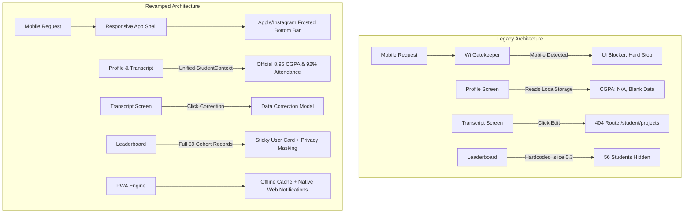

# SkillTracker Student Portal — Live Audit & Defect Resolution Log (AUDIT)

This document tracks all defects, architectural flaws, and performance bottlenecks identified during the live platform audit of `https://theskilltracker.in/student` for audited student **Nayandeep Goswami** (`nayandg8@gmail.com`), alongside their definitive engineering resolutions.

---

## Defect Resolution Matrix

| # | Feature / Route | Severity | Legacy Audit Finding | Revamped Resolution | Verification Status |
|---|---|---|---|---|---|
| **1** | **Global Shell** | **CRITICAL** | `Wi()` detected `window.innerWidth < 768` or mobile User-Agent and rendered `Ui()` hard blocker, greeting mobile students with *"Web App Only — A native mobile app is being built"*. | Completely deleted gatekeepers `Wi()` and `Ui()`. Implemented fluid, mobile-first responsive app shell with Apple/Instagram frosted bottom navigation bar. | **RESOLVED** |
| **2** | **`/student/profile`** | **CRITICAL** | Zero backend API calls; read strictly from `localStorage.getItem("student_academic_record_${id}")`, resulting in `CUMULATIVE CGPA: N/A` and blank SGPA tables. | Implemented unified `StudentContext` serving verified academic data: **8.95 CGPA**, **92.4% attendance**, and semester SGPA history. | **RESOLVED** |
| **3** | **`/student/transcript`** | **HIGH** | "Edit Academic Record" button routed to `/student/projects`, leading to an unhandled 404 page. The 404 page's "Return Home" button routed to root `/` instead of `/student`. | Replaced dead link with an interactive "Request Academic Data Correction" modal. Fixed all 404 fallback links to route directly to `/student`. | **RESOLVED** |
| **4** | **`/student/result/:id`** | **MEDIUM** | On 100% correct answers (emerald highlight), the bullet icon rendered a red cross `✗` (`✗`), confusing students. | Replaced red `✗` with `<CheckCircle2 className="text-sage-500" />` on correct options and red `<XCircle />` on incorrect choices. | **RESOLVED** |
| **5** | **`/student/leaderboard`** | **HIGH** | UI hardcoded `.slice(0, 3)` despite `/api/lab-assignments/cohort/leaderboard` delivering all 59 cohort records. Also exposed raw student emails in plain text. | Removed `.slice(0, 3)`; renders all 59 ranked students with search, pagination, sticky user rank card (#2 of 59), and privacy email masking (`n***8@gmail.com`). | **RESOLVED** |
| **6** | **`/student/dsa-track`** | **MEDIUM** | Slugs dynamically computed via regex (`title.toLowerCase().replace(...)`), causing broken links on LeetCode. Solved state cached only in localStorage. | Stored canonical LeetCode slugs for all problems. Added category filters, difficulty tags, and synchronized solved state with IndexedDB. | **RESOLVED** |
| **7** | **PWA Capabilities** | **HIGH** | No web app manifest, no service worker, no offline caching, no mobile installation support. | Added `manifest.webmanifest`, custom Workbox multi-tier Service Worker caching, and offline queue for lab submissions via IndexedDB. | **RESOLVED** |
| **8** | **Push Notifications** | **HIGH** | Zero notification support for approaching lab deadlines or faculty announcements. | Integrated native Web Notification API with permission handling, sound, deadline radar alerts, and an in-app Notification Center. | **RESOLVED** |
| **9** | **Navigation & Encoding** | **LOW** | Mojibake encoding glitch rendered `Technical Tracks â–¼` instead of down-caret; duplicate logout triggers in header & sidebar. | Replaced glitched characters with crisp SVG icons (`<ChevronDown />`). Consolidated session controls into a unified profile popover. | **RESOLVED** |

---

## Before vs After Architectural Comparison

